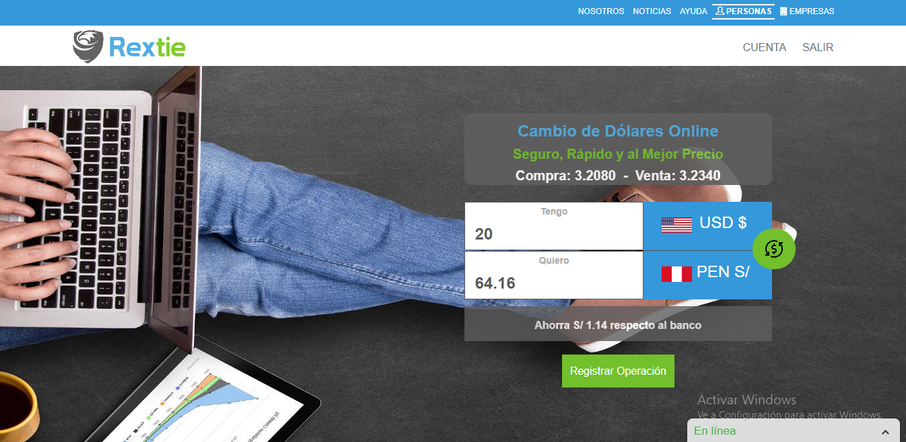
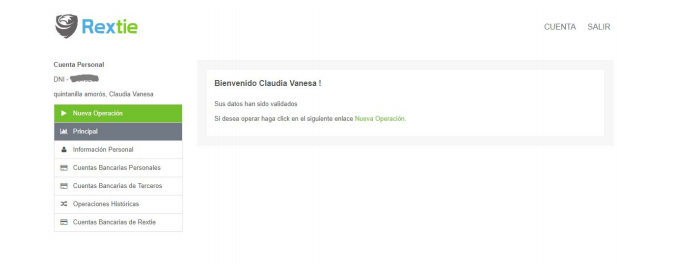
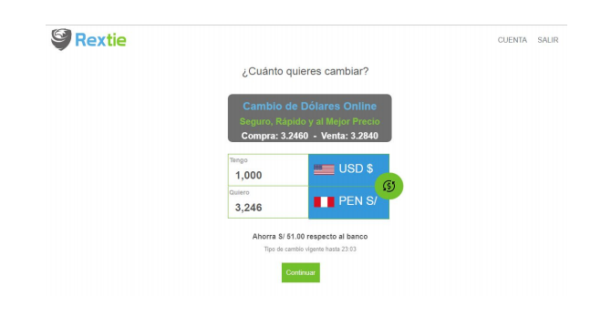
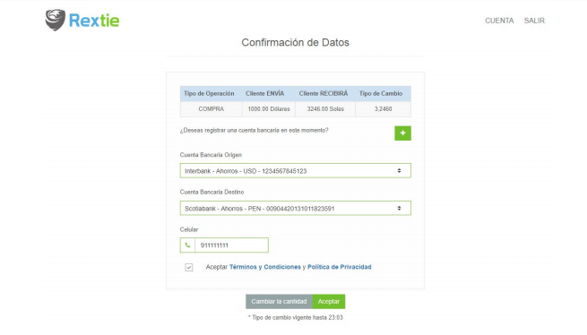
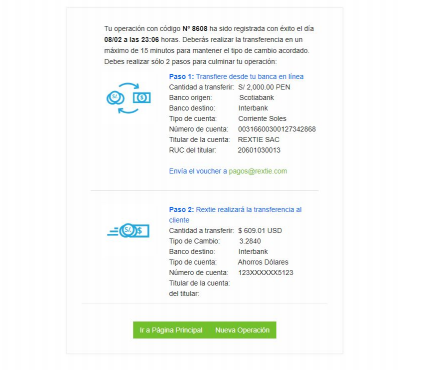
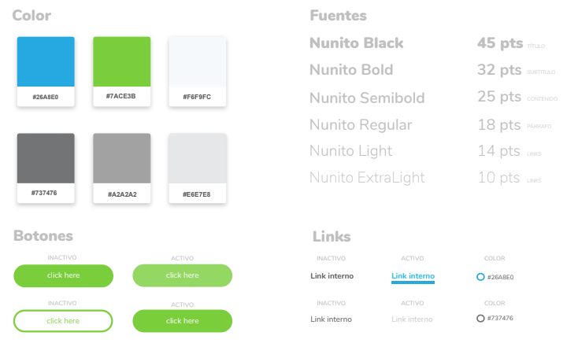
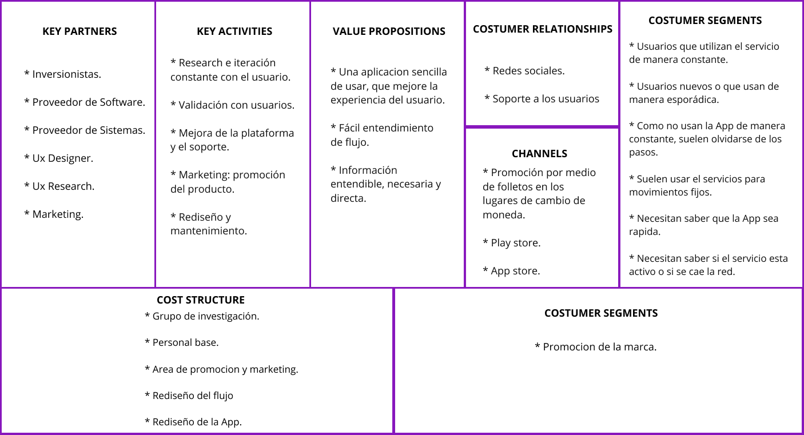

# **REXTIE**
Rextie es un servicio de cambio de dólares por internet (www.rextie.com) registrado
como casa de cambio en la Superintendencia de Banca, Seguros y AFP (SBS). Está
dirigido a personas, pequeñas y medianas empresas.

Lo que te ofrece Rextie.com

### **Un precio justo**
Te ofrecemos la mejor tasa de cambio del mercado.

### **Tu seguridad**

Tu información financiera es confidencial y no debes exponer tu integridad física. Al realizar todo el proceso por Internet no requerimos billetes físicos para efectuar la operación.

### **Tu comodidad**

Tu tiempo es valioso. No lo inviertas buscando tasas en el mercado, pasando por autorizaciones o asistiendo a lugares físicos para realizar esta operación.

### **100% Digital**

No hay papeles ni billetes en el proceso.

### **Tu experiencia**

Usamos un lenguaje fácil de entender y transparencia en la información. Queremos que estés informado y que nos cuentes como sientes nuestro servicio para mejorarlo día a día.

## **OBJETIVO DEL PROYECTO**

Proponer un nuevo diseño de la aplicación web (zona privada) que facilite a los
usuarios realizar una cotización y operación de cambio de dólares.

Para ello se muestran las pantallas principales y secuencia de operación de compra/venta de dólares:

**Paso 1:**

El usuario ingresa a la zona privada y se encuentra con la bienvenida a la página. Se debe tener en cuenta que cuando un cliente ingresa a la zona privada es porque quiere cotizar (realizar una operación) en su mayoría de veces.
   

El menú lateral izquierdo muestra las opciones habilitadas:

*  Información personal: datos de nombres y apellidos, documento de identidad,
fecha de nacimiento, entre otros.

*  Cuentas bancarias personales: registro de cuentas de ahorro o corriente del cliente.

*  Cuentas bancarias de terceros: registro de cuentas de ahorro o corriente de un beneficiario.

*  Operaciones históricas: historial de operaciones del cliente realizadas en la
plataforma.

*  Cuentas bancarias de Rextie: información de banco y número de cuenta de Rextie.

**Paso 2:** 

El usuario ingresa el valor que quiere cambiar y siempre se publica el tipo de cambio de compra y venta. **Aunque el usuario con el diseño actual no tiene claro cuándo es compra y cuando es venta.**

**Es obligatorio que cuando se llene cualquiera de los dos campos (Tengo o Quiero), el otro campo (Quiero o Tengo) se auto complete con el cálculo de tipo de cambio de compra o venta según corresponda.**

**Paso 3:**

Se debe tener **claridad sobre la cuenta destino a la cual se enviará el cambio.** Esto es de suma relevancia porque un error en este paso haría que el cliente elija una cuenta
(registrada) en la que no quiere recibir sus fondos.
**En este paso también se solicitará la actualización de su número de celular, previamente ingresado en el registro del usuario.**

**Paso 4:**

Se envía una notificación de los dos siguientes pasos que siguen en el proceso de cambio de dólares. **Es relevante que se resalte que el siguiente paso es Transferir desde tu banca en línea, donde se declara el número de cuenta de Rextie.** 
Algunos clientes comenten un error en este paso y transfieren a una cuenta de Rextie que la tienen grabada o transfieren a su propio número de cuenta.

**OJO:**
Tipografía y patrones de colores:

## **INVESTIGACIÓN**

## **Bussines Model Canvas de Rextie**

## **Prototipo en alta fidelidad**
[Prototipo](https://marvelapp.com/85477bh/screen/39919021)
